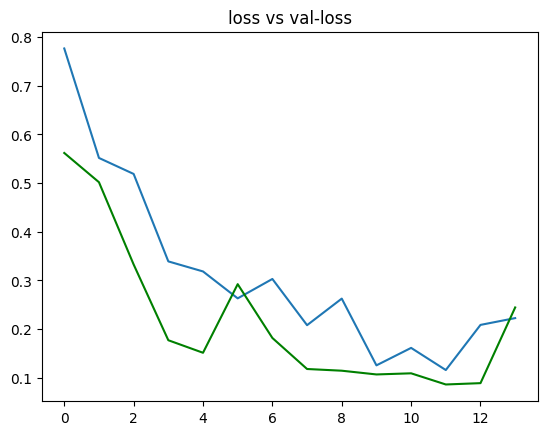
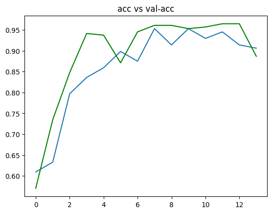

# Brain Tumor Detection

Building a detection model using a convolutional neural network in TensorFlow & Keras.  
The dataset used is a collection of brain MRI images found on Kaggle. You can find it [here](https://www.kaggle.com/datasets/masoudnickparvar/brain-tumor-mri-dataset).

**About the data:**  
The dataset contains 4 folders. For this test, only two folders were used: glioma tumor and no tumor.

## Data Augmentation:

**Why did I use data augmentation?**

Since this is a small dataset, there weren’t enough examples to train the neural network effectively. Data augmentation also helped tackle the data imbalance issue.  

Further explanations can be found in the notebook.

## Data Split:

The data was split as follows:
1. 70% of the data for training.
2. 15% of the data for validation.
3. 15% of the data for testing.

---

# Training the Model

The model was trained for 30 epochs, and these are the loss and accuracy plots:





---

# Results

The best model (the one with the highest validation accuracy) detects brain tumors with:

**91.2%** accuracy on the **test set**.  
These results are quite good, considering the data imbalance.

**Performance table of the best model:**

|              | Validation Set | Test Set |
|--------------|----------------|----------|
| Accuracy    | 91%            | 96%      |

---

# Final Notes

**What's in the files?**
1. Code in the IPython notebooks.
2. The arrangement of the dataset (you can remove it if you want to try from the beginning).
3. The models are stored as *.model* files. They can be restored as follows:

```python
from keras.models import load_model
model = load_model("bestmodel.h5")
```

> This code was tested in Colab, so the paths aren't fixed. If you want to try it there, please adjust the paths accordingly.<br>

* If you need any further help, please contact me. *


Contributes are welcome!
<br>Thank you!


